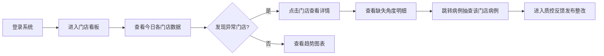
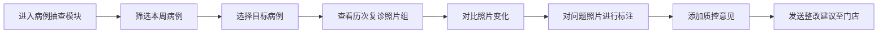
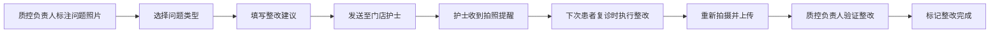

## 1. 产品概述

面向连锁口腔机构正畸负责人和院长的数据化复诊照片质控平台，帮助管理多门店正畸复诊拍照规范性和复诊记录完整性，不直接替代医生诊断，而是作为质控管理工具。通过数字化手段实现门店拍照质量的可视化监控、病例抽查和质控反馈闭环。

- **目标用户**：连锁口腔机构院长、正畸主任、质控负责人
- **核心价值**：降低正畸复诊照片漏拍率、提高照片拍摄质量、建立标准化质控流程、实现多门店统一管理

## 2. 核心功能

### 2.1 用户角色

| 角色 | 登录方式 | 核心权限 |
|------|---------|----------|
| 院长/机构管理者 | 账号密码登录 | 查看所有门店看板、查看质控统计、导出报表 |
| 正畸主任/质控负责人 | 账号密码登录 | 病例抽查、发布质控反馈、查看整改进度 |
| 门店医生/护士 | 账号密码登录 | 查看本门店提醒、查看质控反馈、执行整改 |

### 2.2 功能模块

1. **门店看板**：按日期展示各诊所正畸复诊数据统计，包括复诊人数、已完成拍照人数、缺失角度数量、重拍比例，支持按门店和日期筛选
2. **病例抽查**：按医生、护士、治疗阶段筛选病例，查看每次复诊的照片组和备注，支持周会点评模式
3. **质控反馈**：对单张照片标注问题（焦点模糊、拉钩不到位、牙列未咬紧等），发送整改建议至门店，护士拍照时可见提醒

### 2.3 页面详情

| 页面名称 | 模块名称 | 功能描述 |
|---------|---------|----------|
| 门店看板页 | 顶部筛选栏 | 日期选择器、门店多选下拉、数据刷新按钮 |
| 门店看板页 | 核心指标卡片 | 展示总复诊人数、拍照完成率、平均缺失角度数、重拍率4个KPI |
| 门店看板页 | 门店数据表格 | 逐行展示各门店详细数据，包含缺失角度详情列（侧貌、咬合照等） |
| 门店看板页 | 趋势折线图 | 近7天/30天拍照完成率和重拍率趋势 |
| 门店看板页 | 缺失角度分布图 | 饼图展示各类缺失角度占比，快速定位常见漏拍问题 |
| 病例抽查页 | 筛选条件区 | 按医生、护士、治疗阶段（初诊、排齐、收缝、保持）、日期范围筛选 |
| 病例抽查页 | 病例列表卡片 | 展示患者基本信息、治疗阶段、医生护士、最新复诊日期 |
| 病例详情抽屉/弹窗 | 复诊时间轴 | 按时间倒序展示所有复诊记录 |
| 病例详情抽屉/弹窗 | 照片组展示 | 7宫格标准照片位展示（正面、侧面、45°、上下颌咬合等），缺失位以灰色占位显示 |
| 病例详情抽屉/弹窗 | 医生备注区 | 展示每次复诊的医生诊断备注 |
| 质控反馈页 | 待反馈病例列表 | 展示需要质控的病例和照片，标记问题照片数量 |
| 质控反馈页 | 照片标注工具 | 点击单张照片进入标注模式，选择问题类型、添加文字说明、画框标注区域 |
| 质控反馈页 | 整改建议发送 | 批量选择问题照片，发送整改建议至对应门店护士 |
| 质控反馈页 | 整改状态追踪 | 查看已发送反馈的整改状态（待整改、已整改、已验证） |
| 全局组件 | 侧边导航栏 | 三大模块切换，用户信息和角色展示 |
| 全局组件 | 顶部面包屑 | 当前位置导航，快速跳转 |

## 3. 核心流程

### 3.1 院长日常监控流程

### 3.2 正畸主任周会点评流程

### 3.3 质控反馈闭环流程

## 4. 用户界面设计

### 4.1 设计风格

- **设计基调**：专业医疗感、数据可视化、清爽简洁，强调信任感和专业度
- **主色调**：深海蓝 `#1e3a5f`（权威、专业），搭配青绿色 `#10b981`（健康、通过）
- **辅助色**：琥珀橙 `#f59e0b`（警告、待处理），珊瑚红 `#ef4444`（异常、需整改）
- **中性色**：冷灰系列 `#f8fafc #f1f5f9 #e2e8f0 #94a3b8 #475569 #1e293b`
- **按钮风格**：圆角 8px，悬停态有轻微上浮阴影，禁用态灰显
- **字体方案**：
  - 标题："Noto Sans SC"，字重 600-700，大小 20-28px
  - 正文："Noto Sans SC"，字重 400-500，大小 13-14px
  - 数字展示："JetBrains Mono" 等宽字体，突出数据感
- **布局风格**：左侧固定导航 + 顶部栏 + 主内容区的经典 Dashboard 布局，卡片式内容容器
- **图标风格**：Lucide 线性图标，统一 18px 尺寸，保持细线一致感
- **数据卡片**：1px 边框 + 4px 圆角 + 顶部 3px 彩色状态条
- **照片展示**：卡片式照片墙，问题照片左上角红色徽章标记，缺失照片灰色虚线占位

### 4.2 页面设计概览

| 页面名称 | 模块名称 | UI 元素 |
|---------|---------|---------|
| 门店看板页 | KPI 卡片 | 4列等宽卡片，左侧彩色竖条 + 大号数据指标 + 同比变化百分比 |
| 门店看板页 | 数据表格 | 斑马纹行，缺失角度用彩色标签（侧貌-蓝、咬合-橙等） |
| 门店看板页 | 图表区 | 双栏布局，左折线图右饼图，Recharts 组件 |
| 病例抽查页 | 筛选区 | 内联表单，标签 + 下拉/日期选择器，紧凑排列 |
| 病例抽查页 | 病例卡片 | 头像 + 基本信息网格 + 状态标签 + 快捷查看按钮 |
| 病例详情弹窗 | 时间轴 | 左侧竖线时间轴，右侧复诊节点卡片 |
| 病例详情弹窗 | 照片组 | 3x3 九宫格布局，每张照片有角标和状态 |
| 质控反馈页 | 照片标注 | 照片浮层 + 问题类型侧栏 + 手绘矩形标注工具 |
| 质控反馈页 | 反馈表单 | 左侧照片预览，右侧问题清单和整改建议输入 |

### 4.3 响应式设计

- **Desktop-first**：主设计分辨率 1440x900，最小支持 1280px 宽度
- **平板适配**：1024px 以下，侧边栏收起为图标模式，表格列数自适应减少
- **不支持手机端**：该平台为内部管理系统，主要在桌面端和平板横屏使用

### 4.4 动画与交互细节

- 页面切换：淡入过渡 200ms ease
- 卡片悬停：box-shadow 加深 + translateY(-2px)，150ms 过渡
- 数据加载：骨架屏 pulse 动画
- 照片悬停：轻微放大 1.02 倍 + 边框高亮
- 标注工具：鼠标按下时十字准星光标
- 反馈提交：成功/失败状态的 Toast 通知，从顶部滑入
