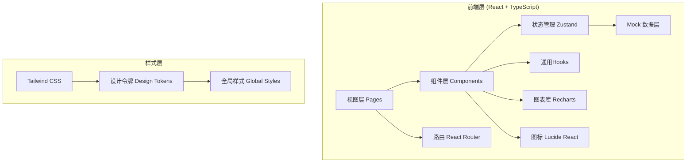

## 1. 架构设计



## 2. 技术描述

- **前端框架**：React 18 + TypeScript
- **构建工具**：Vite 5.x
- **样式方案**：Tailwind CSS 3.x
- **状态管理**：Zustand 4.x
- **路由方案**：React Router DOM 6.x
- **图表库**：Recharts 2.x（折线图、饼图、柱状图）
- **图标库**：Lucide React
- **后端**：无后端，纯前端 Mock 数据（`src/mock/` 目录模拟 API）
- **数据存储**：LocalStorage 持久化用户操作和质控反馈记录

**选择理由**：
- 该平台为内部管理系统，前期快速验证阶段采用纯前端 Mock 方案即可满足演示需求
- Zustand 比 Redux 更轻量，适合中小型 Dashboard 项目
- Recharts 基于 React 组件化设计，与项目技术栈高度契合

## 3. 路由定义

| 路由路径 | 页面名称 | 用途 |
|---------|---------|------|
| `/` | 重定向 | 自动跳转到门店看板 |
| `/dashboard` | 门店看板 | 展示各门店正畸复诊拍照数据统计和趋势图表 |
| `/cases` | 病例抽查 | 病例列表筛选、病例详情查看、复诊照片组浏览 |
| `/cases/:caseId` | 病例详情 | 单病例完整时间轴和照片详情（可由弹窗代替） |
| `/quality` | 质控反馈 | 待质控病例列表、照片标注、整改建议发送、整改追踪 |

## 4. 数据模型与类型定义

### 4.1 核心类型定义

```typescript
// 门店信息
interface Clinic {
  id: string;
  name: string;
  address: string;
  manager: string;
  phone: string;
}

// 正畸标准拍照角度
type PhotoAngle = 
  | 'frontal'        // 正面像
  | 'frontalSmile'   // 正面微笑像
  | 'lateral'        // 侧面像（侧貌）
  | 'lateral45'      // 45°侧面像
  | 'upperOcclusal'  // 上颌咬合像
  | 'lowerOcclusal'  // 下颌咬合像
  | 'occlusion'      // 正中咬合像
  | 'overjet'        // 覆盖像
  | 'overbite';      // 覆𬌗像

// 缺失角度统计
interface MissingAngle {
  angle: PhotoAngle;
  label: string;
  count: number;
}

// 门店看板每日数据
interface ClinicDailyData {
  clinicId: string;
  clinicName: string;
  date: string;          // YYYY-MM-DD
  totalPatients: number; // 复诊人数
  photographedCount: number;  // 已完成拍照人数
  missingAngles: MissingAngle[];  // 缺失角度明细
  retakeCount: number;  // 重拍数量
  retakeRate: number;   // 重拍比例
  completionRate: number; // 拍照完成率
}

// 治疗阶段
type TreatmentStage = 
  | 'initial'      // 初诊/检查
  | 'alignment'    // 排齐期
  | 'spaceClosing' // 收缝期
  | 'finishing'    // 精细调整
  | 'retention';   // 保持期

// 医生信息
interface Doctor {
  id: string;
  name: string;
  clinicId: string;
  title: string;  // 职称
}

// 护士信息
interface Nurse {
  id: string;
  name: string;
  clinicId: string;
}

// 患者信息
interface Patient {
  id: string;
  name: string;
  gender: 'male' | 'female';
  age: number;
  caseNumber: string;  // 病历号
}

// 单张照片
interface Photo {
  id: string;
  angle: PhotoAngle;
  angleLabel: string;
  url: string;           // 照片URL
  thumbUrl: string;      // 缩略图
  takenAt: string;       // 拍摄时间
  photographer: string;  // 拍摄护士
  hasIssue: boolean;     // 是否有问题
  issueMarks?: IssueMark[];  // 标注信息
}

// 问题标注
type IssueType = 
  | 'blur'           // 焦点模糊
  | 'hookPosition'   // 拉钩不到位
  | 'biteIncorrect'  // 牙列未咬紧
  | 'incomplete'     // 拍摄不全
  | 'lighting'       // 光线问题
  | 'other';         // 其他

interface IssueMark {
  id: string;
  type: IssueType;
  typeLabel: string;
  description: string;      // 文字描述
  rect: { x: number; y: number; w: number; h: number };  // 相对坐标 0-1
  createdAt: string;
  createdBy: string;        // 质控人
}

// 复诊记录
interface FollowUpVisit {
  id: string;
  caseId: string;
  visitDate: string;
  stage: TreatmentStage;
  stageLabel: string;
  doctorId: string;
  doctorName: string;
  nurseId: string;
  nurseName: string;
  photos: Photo[];
  missingAngles: PhotoAngle[];  // 本次缺失的角度
  doctorNotes: string;          // 医生备注
  feedbackStatus: 'pending' | 'processing' | 'completed';  // 质控状态
}

// 病例（正畸病例）
interface OrthoCase {
  id: string;
  patientId: string;
  patient: Patient;
  clinicId: string;
  clinicName: string;
  doctorId: string;
  doctorName: string;
  currentStage: TreatmentStage;
  currentStageLabel: string;
  startDate: string;
  totalVisits: number;
  latestVisitDate: string;
  visits: FollowUpVisit[];
}

// 质控反馈
interface QualityFeedback {
  id: string;
  caseId: string;
  visitId: string;
  photoId: string;
  issueMark: IssueMark;
  suggestion: string;       // 整改建议
  assignee: string;         // 被指派人（护士）
  assigneeClinicId: string;
  status: 'pending' | 'fixed' | 'verified' | 'rejected';
  statusLabel: string;
  createdAt: string;
  fixedAt?: string;
  verifiedAt?: string;
}

// 趋势数据点
interface TrendDataPoint {
  date: string;
  completionRate: number;
  retakeRate: number;
}
```

## 5. 项目目录结构

```
src/
├── assets/                  # 静态资源（示例照片等）
├── components/              # 通用组件
│   ├── layout/
│   │   ├── Sidebar.tsx          # 侧边导航
│   │   ├── TopBar.tsx           # 顶部栏
│   │   └── AppLayout.tsx        # 整体布局
│   ├── common/
│   │   ├── StatCard.tsx         # 统计卡片
│   │   ├── DataTable.tsx        # 数据表格
│   │   ├── FilterBar.tsx        # 筛选栏
│   │   ├── StatusBadge.tsx      # 状态徽章
│   │   └── EmptyState.tsx       # 空状态
│   ├── dashboard/
│   │   ├── KPICards.tsx         # KPI卡片组
│   │   ├── ClinicDataTable.tsx  # 门店数据表
│   │   ├── TrendChart.tsx       # 趋势折线图
│   │   └── MissingAnglePie.tsx  # 缺失角度饼图
│   ├── cases/
│   │   ├── CaseFilterBar.tsx    # 病例筛选
│   │   ├── CaseCard.tsx         # 病例卡片
│   │   ├── CaseList.tsx         # 病例列表
│   │   ├── CaseDetailDrawer.tsx # 病例详情抽屉
│   │   ├── VisitTimeline.tsx    # 复诊时间轴
│   │   └── PhotoGrid.tsx        # 照片九宫格
│   └── quality/
│       ├── PendingFeedbackList.tsx  # 待质控列表
│       ├── PhotoAnnotation.tsx      # 照片标注工具
│       ├── IssueSidebar.tsx         # 问题类型侧栏
│       ├── FeedbackForm.tsx         # 反馈表单
│       └── FeedbackStatusTracker.tsx # 整改追踪表格
├── hooks/                   # 自定义Hooks
│   ├── useClinicData.ts         # 门店数据Hook
│   ├── useCases.ts              # 病例数据Hook
│   └── useQualityFeedback.ts    # 质控反馈Hook
├── mock/                    # Mock数据
│   ├── clinics.ts              # 门店数据
│   ├── cases.ts                # 病例数据
│   ├── dashboardStats.ts       # 看板统计数据
│   └── feedbacks.ts            # 质控反馈数据
├── pages/                   # 页面组件
│   ├── DashboardPage.tsx       # 门店看板
│   ├── CasesPage.tsx           # 病例抽查
│   └── QualityPage.tsx         # 质控反馈
├── router/                  # 路由配置
│   └── index.tsx
├── store/                   # Zustand状态
│   ├── useDashboardStore.ts
│   ├── useCaseStore.ts
│   └── useQualityStore.ts
├── types/                   # 类型定义
│   └── index.ts
├── utils/                   # 工具函数
│   ├── date.ts                 # 日期处理
│   ├── format.ts               # 格式化（百分比等）
│   └── constants.ts            # 常量映射（角度、阶段、问题类型）
├── App.tsx
├── main.tsx
└── index.css
```

## 6. 状态管理设计

### Zustand Store 划分

**1. useDashboardStore** - 门店看板状态
```typescript
{
  selectedDate: string;           // 筛选日期
  selectedClinicIds: string[];    // 筛选门店
  dailyData: ClinicDailyData[];   // 当日各门店数据
  trendData: TrendDataPoint[];    // 趋势数据
  setSelectedDate: fn,
  toggleClinic: fn,
  fetchDailyData: fn,
  fetchTrendData: fn,
}
```

**2. useCaseStore** - 病例抽查状态
```typescript
{
  cases: OrthoCase[];
  filteredCases: OrthoCase[];
  selectedCaseId: string | null;
  filter: {
    doctorId: string | null;
    nurseId: string | null;
    stage: TreatmentStage | null;
    dateRange: [string, string] | null;
  };
  setFilter: fn,
  selectCase: fn,
  loadCases: fn,
}
```

**3. useQualityStore** - 质控反馈状态
```typescript
{
  pendingPhotos: { caseId: string; visitId: string; photo: Photo }[];
  currentAnnotation: { photoId: string | null; marks: IssueMark[] };
  feedbacks: QualityFeedback[];
  addMark: fn,
  removeMark: fn,
  submitFeedback: fn,
  updateFeedbackStatus: fn,
}
```
